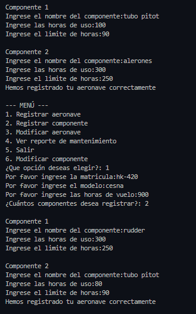
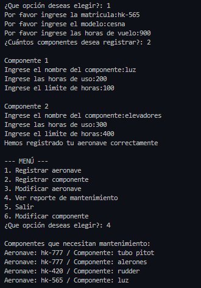

# 📝 Plantilla de Autoevaluación: Gestión de Mantenimiento de Flota Aeronáutica ✈️

**Instrucciones para los estudiantes:**
1. Hagan una copia de este archivo y guárdenlo en la raíz de su repositorio con el nombre `AUTOEVALUACION.md`.
2. Lean cuidadosamente cada criterio de la rúbrica.
3. En el apartado **Nota Esperada**, asignen una calificación numérica (de 0.0 a 5.0) que consideren justa para su trabajo en ese criterio.
4. En el apartado **Justificación**, expliquen con sus propias palabras por qué merecen esa nota. Sean críticos y honestos.
5. En el apartado **Evidencia**, inserten pantallazos de la ejecución de la consola, imágenes de su diagrama o bloques de código (usando la sintaxis de Markdown con \`\`\`) que respalden su justificación.
6. Al final, calculen su nota definitiva esperada según los porcentajes.

---

## 👥 1. Información del Equipo

* **Miembro 1:** Veronica Alexandra Micanquer Moreno - 000588473
* **Miembro 2:** Cristian Camilo Martinez - 000577270

---

## 📊 2. Evaluación por Criterios

### Criterio 1: Diagrama y Lógica (Valor: 20%)
*Evalúa si el diagrama es claro, lógico y representa fielmente la estructura de datos utilizada (listas/diccionarios) y el flujo del programa.*

* **Nota Esperada (0.0 - 5.0):** 4.0
* **Justificación:** 
  > *Consideramos que merecemos un 4.0 porque el diagrama de flujo representa de forma clara el funcionamiento del programa, mostrando el paso a paso del menú, el registro de aeronaves y la gestión de componentes. Se entiende bien la lógica general y la relación entre las diferentes partes del sistema. Sin embargo, al ser un diagrama bastante extenso, algunas secciones pueden volverse un poco difíciles de seguir a primera vista. Para facilitar la comprensión del diagrama, utilizamos colores para diferenciar procesos, decisiones y flujos, lo que ayudó a organizar mejor la información. Esta estrategia fue clave porque el diagrama se extendió bastante y podía generar confusión, así que los colores nos permitieron hacerlo más claro y fácil de interpretar.El diagrama tambien lo anexamos afuera por su extension.


   

### Criterio 2: Uso de Estructuras (Listas y Diccionarios) (Valor: 30%)
*Evalúa si se utilizaron diccionarios y listas de manera correcta y anidada para almacenar los datos ingresados por el usuario, sin redundancias.*

* **Nota Esperada (0.0 - 5.0):** 5.0
* **Justificación:**
  > *Usamos una lista principal llamada Aeronaves, allí se guardaran distintos diccionarios que guradarán la información de cada aeronave.Cada aeronave tiene claves, hay una clave que es una lista que será utilizada para guardar los componentes.Finalmente cada componente se guarda dentro de un diccionario.*
* **Evidencia:**
  
  ```python
  #Primer ejemplo
   # Crear diccionario del componente
            componente = {
                "nombre": nombre,
                "horas_uso": horas_uso,
                "limite": limite
            }

            # Agregar el diccionario del componente al final de la lista de componentes de la aeronave.
            aeronave["componentes"].append(componente)      #Accede a la lista "componentes" y despues agrega el diccionario "componente" 
  #Segundo ejemplo
   # Creamos un diccionario para guardar esta información
        aeronave = {
            "matricula": matricula,
            "modelo": modelo,
            "horas_vuelo": horas_vuelo,
            "componentes": []  # Lista vacía donde se guardarán los componentes
        }

        numero_componentes = int(input("¿Cuántos componentes desea registrar?: "))
        
        
        for i in range(numero_componentes):
            
            # Mostrar número del componente actual
            print("\nComponente", i + 1)

            # Solicitar datos del componente
            nombre = input("Ingrese el nombre del componente:")
            horas_uso = float(input("Ingrese las horas de uso:"))
            limite = float(input("Ingrese el limite de horas:"))

            # Crear diccionario del componente
            componente = {
                "nombre": nombre,
                "horas_uso": horas_uso,
                "limite": limite
            }

            aeronave["componentes"].append(componente)      

        Aeronaves.append(aeronave) 


### Criterio 3: Cumplimiento de Restricciones Técnicas (Valor: 20%)
*Evalúa el respeto total a las reglas: uso de ciclos clásicos (for/while), cero uso de list comprehensions, y ninguna librería/función avanzada no vista en clase.*

* **Nota Esperada (0.0 - 5.0):** 5.0
* **Justificación:**
    > *Dentro de nuestro codigo podemos encontrar el uso de for y while, podemos decir que el que más utilizamos fue el for para poder buscar los componentes dentro de las listas o diccionarios, ya que el for nos ayuda a recorrer esos elementos.Además, no empleamos librerías ni funciones avanzadas, solo herramientas básicas vistas en clase como input, print, len y append.

### Criterio 4: Funcionalidad del Código (Valor: 15%)
*Evalúa si el programa pide datos correctamente, no se "crashea" y genera el reporte final de mantenimiento esperado.*

* **Nota Esperada (0.0 - 5.0):** 5.0
* **Justificación:**
    > *Nuestro programa permite que el usuario ingrese los datos de varias aeronaves, y los va almacenando.El usuario tiene la opcion de registrar las aeronaves que el quiera, registrar nuevos componentes, modificar las aeronaves, o modificar componentes.Otra de las opciones es que permite hacer un reporte de los componentes de las aeronaves que necesitan mantenimiento, para ello muestra  la matricula de la aeronave junto con el componente que necesita mantenimiento.*
* **Evidencia:** 


--- 


### Criterio 5: Preparación para Sustentación (Valor: 15%)
*Aunque esta nota la dará el profesor en la entrevista oral, autoevalúen su nivel de preparación y comprensión del código que entregaron.*

* **Nivel de Confianza (Bajo / Medio / Alto):** Medio
* **Justificación:**
    > *Durante el desarrollo del programa fuimos entendiendo mejor cómo funcionan las listas y los diccionarios, y cómo nos ayudan a organizar la información de las aeronaves y sus componentes de forma clara. También nos dimos cuenta de que la indentación es clave, porque define el flujo del programa y si se usa mal puede cambiar completamente el resultado. Más que solo hacer que el código funcione, este proceso nos permitió entender lo que estábamos haciendo y por qué, lo que nos da más seguridad al momento de explicarlo.*
* **Evidencia de preparación: Usamos una estrategia en la que revisamos el código juntos y fuimos explicando cada parte en voz alta, línea por línea, para asegurarnos de que ambos lo entendíamos. Además, nos turnamos en algunos momentos para escribir y para revisar, corrigiendo errores y probando el programa con diferentes datos, lo que nos ayudó a confirmar que los dos dominamos cómo funciona.**

### 📈 3. Cálculo de Nota Definitiva Esperada
Multipliquen la nota asignada en cada criterio por su porcentaje respectivo y sumen los resultados para obtener su nota final esperada.

|Criterio	|Nota |Asignada	|Peso	|Subtotal |(Nota * Peso) |
|---|---|---|---|---|---|
|1. Diagrama y Lógica	|4.0	|20% |(0.2)	|[Resultado]|
|2. Uso de Estructuras	|5.0 |30% |(0.3)	|[Resultado]|
|3. Cumplimiento Restricciones|	5.0	|20% |(0.2)	|[Resultado]|
|4. Funcionalidad	|5.0	|15% |(0.15)	|[Resultado]|
|5. Sustentación (Estimado)|	4.0|	15%| (0.15)|	[Resultado]|

NOTA FINAL ESPERADA		100%	[4.65]

✨ ""La educación es para el carácter, no solo para la mente"." ✨